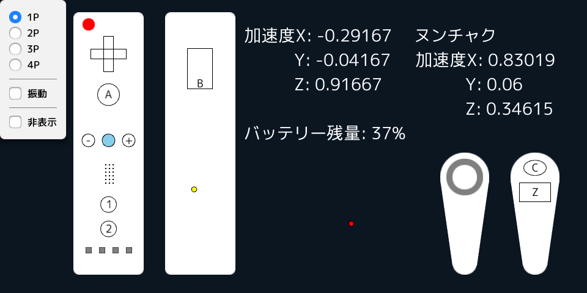

# wm4s3d

Siv3DでWiiリモコンを使う為のプログラムです。

## スクリーンショット

## 作者

Oyakodon (<https://twitter.com/alltekito>)

## 特徴

- Wiiリモコンのボタンの状態や加速度、赤外線情報(ポインター)、ヌンチャクの情報が取得できます
- Wiiリモコンのスピーカーから音が出せます (音質がとても悪いですが...)
- Siv3Dで使いやすい工夫をしています (wii.buttonA.pressedなど)

## 開発環境

- Siv3D August 2016 v2 (<https://github.com/Siv3D/Reference-JP/wiki>)
- Microsoft Visual C++ 2015 Update 3
- Microsoft Visual Studio Community 2017

## プロジェクト

- wm4s3d : wm4s3d本体。実行すると、上のスクリーンショットのように動作確認ができます。
- Wiimote : Wiiリモコンとの通信をするプログラム。コアの部分です。

## 使い方・動作確認

- Visual Studioでプロジェクトをビルドしてください。
  - Siv3Dが必要です。
  - Engineフォルダは容量の関係でリポジトリに含めていないので、注意してください。

- Windows 10でのWiiリモコンのBluetoothペアリングは起動前に済ませてください。
  - 参考 : <https://shirabeta-stock.com/wiiremote_pairing/>

- Windows 10 (バージョン1703, OSビルド15063.674)で、Wiiリモコン2台同時接続ができることを確認しています。 (ヌンチャクも確認済み)

## sample.raw

sample.rawは

「サイバー03」 by Music is VFR

<http://musicisvfr.com/free/se/cyber01.html>

をsox(<http://sox.sourceforge.net/>)を使って変換したものです。

※参考 ： <http://pu2x.hatenablog.com/entry/2017/04/05/204826>

## ライセンス

MIT License